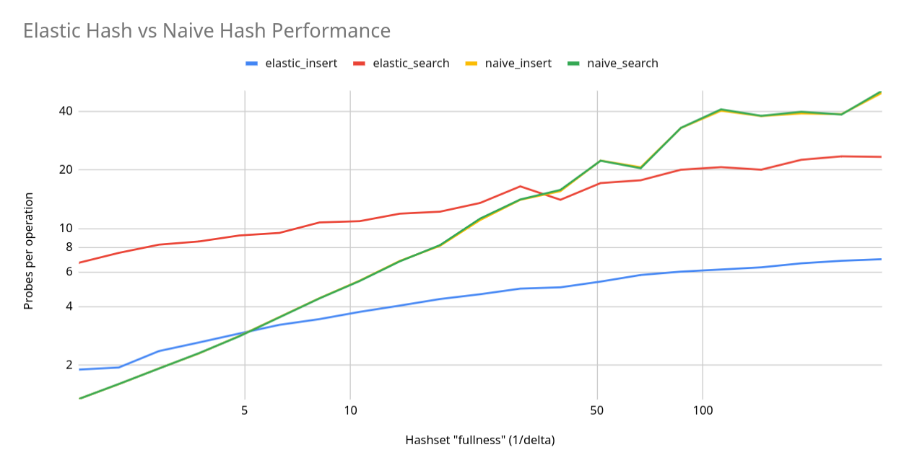

# Elastic Hash Implementation

`test.py` has the testing infrastructure.

`naive.py` has a naive hashtable implementation.

`elastic.py` has the elastic hash implementation.

Results from testing are outputted to `results.csv`.

The devlog is in `devlog.md`.

## Elastic Hash Reference

The elastic hash algorithm operates on geometrically shrinking sub-arrays that elements get split between. `SubArray` is the class that implements this. It has basic operations such as `probe_empty` (return if the index is empty), `insert` (insert a value at the index), and `__getitem__` (return value from spot).

The global variables `p` and `a` are config variables for the hashing function. `p` is a known prime and `a` provides randomness.

The functions `phi` and `hphi` are used to hash the (i, j) probe pairs into a single index. `phi` is just an implementation of the phi function from the paper, using a binary representation to map N^2 -> N. `hphi` is a hash function applied to `phi`.

The main part of the file, `ElasticHashtable` implements the core of the algorithm.

`__init__` is simple, it mostly instantiates the subarrays in sizes half that of the previous subarray (ie. geometrically decreasing in size) and creating and sorting the `valid_probes` list (used for searching).

`get_batch_size` implements an expression from the paper, calculating the size of a given batch for the input size.

`insert` just calls `insert_from_batch` and updates the state of the hashtable (incrementing the batch number if needed, otherwise just decrementing the `left_in_batch` counter).

`insert_from_batch` looks at the two tables a the given batch could insert to, takes their epsilon (how empty are they), and then goes through several cases laid out in the paper:

(0.) If it's batch number zero, just insert in the first table.

1. If both tables have plenty of space, try inserting to the larger one first (up to some threshold, `f(e1)`) and then the smaller one.

2. If the first (larger) table is very full, just insert to the second (smaller) one.

3. Else, (if the second table is very full and the first isn't), just insert to the first table. (This can be expensive but is *very* rare.)

`search` iterates through the sorted `valid_probes` until it finds the desired value.

## Findings

I (roughly) tuned the parameters of the elastic hash for this test, so I think that this is representative of a somewhat optimized implementation.

Some things of note:

1. While naive insertions and searches are identical (they are literally the same operation), elastic insertions and searches differ *drastically*. This is because, while the insertion is very efficient by spreading across multiple sub-arrays, the serches have to then probe all of those sub-arrays, resulting in somewhat high probes per operation.

2. The elastic operations scale much better to extremely full hashtables. The crossover happens (for search) at around `1/delta = 40` => `table is 97.5% full`. While it's impressive how smooth it grows (it grows logarithmically), I'm not sure how practical this actually is, because just increasing your table size by 5% would trivially make naive more efficient (with much less complexity, too).

3. There is a lot of noise for the naive methods at the very full hashsets because it becomes very luck-dependent of whether an operation will take 20 probes or 200. This may be a more compelling use case for elastic hashing because its operations are closer to constant-time and predictable (although, I should note, are NOT constant time or bounded in any meaningful way).
